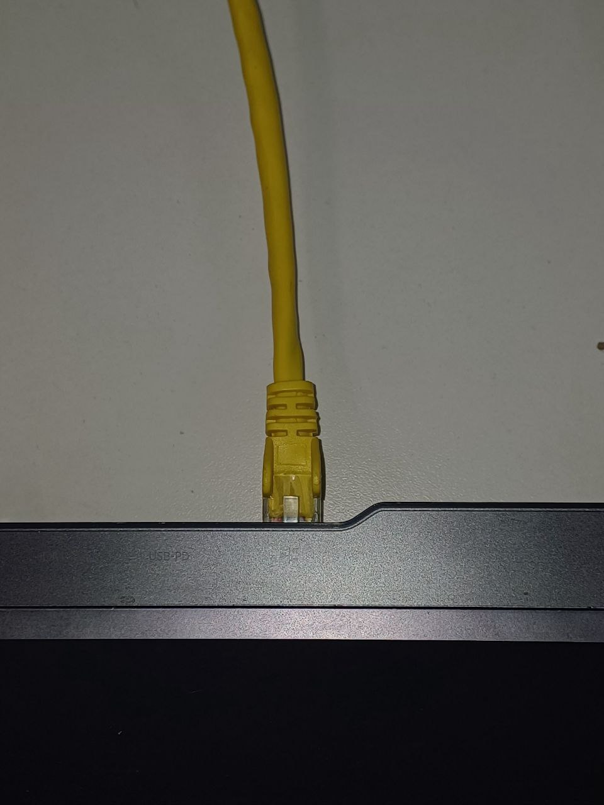

# ur5e ros2 iron

This repo contains two workspaces to use the Merlin's Ur5e robot (real or simulated in Gazebo).
The robot can be controlled with with [cartesian compliance controllers](https://github.com/fzi-forschungszentrum-informatik/cartesian_controllers).

The ``` ros2_real``` workspace has to be used to interact with the real robot. 
The ``` ros2_sim``` workspace has to be used to interact with a Gazebo simulated robot. 

Inside the ``` src``` folder in each of them there are the ros2 iron packages to be installed. 

Outline:
- [Dependencies](#dependencies)  
- [How to Use a Real Robot with ROS 2](#how-to-use-a-real-robot-with-ros-2)  
- [How to Use a Simulated Robot with ROS 2 and Gazebo](#how-to-use-a-simulated-robot-with-ros-2-and-gazebo)  


## Dependencies
Before starting, ensure that your computer is set up with the following dependencies on a Ubuntu 22 runing OS:

- Installed [Python3 and pip](https://phoenixnap.com/kb/how-to-install-pip-on-ubuntu)

- Installed [colcon](https://docs.ros.org/en/foxy/Tutorials/Beginner-Client-Libraries/Colcon-Tutorial.html#install-colcon)

- Installed ROS 2 (Iron)
Follow the instructions provided in the [ROS 2 Iron Installation Guide](https://docs.ros.org/en/iron/Installation/Ubuntu-Install-Debs.html#install-ros-2) to install the ROS 2 Iron distribution.

- Configured your ROS 2 environment by ensuring [rosdep](https://docs.ros.org/en/iron/Tutorials/Intermediate/Rosdep.html#rosdep-installation) is installed and properly configured.

- Installed additional System Packagesusing your package manager (e.g., apt for Ubuntu):

    - Build tools: ```build-essential```, ```cmake```, ```git-all```, ```software-properties-common```
    - ROS utilities: ```ccache```, ```ros-iron-ament-cmake```, ```ros-iron-cv-bridge```, ```ros-iron-tf-transformations```, ```ros-iron-librealsense2*```, ```ros-iron-realsense2-*```, ```ros-iron-rviz2```
    - Graphics libraries: ```libgl1-mesa-dev```, ```libglu1-mesa-dev```, ```freeglut3-dev```, ```mesa-common-dev```
    - Development tools: ```libeigen3-dev```, ```libflann-dev```, ```libboost-all-dev```
    - Additional libraries: ```libssl-dev```, ```libusb-1.0-0-dev```, ```libopenni-dev```, ```libopenni2-dev```, ```libpcap-dev```, ```libpng-dev```, ```libqhull-dev```, ```libgtest-dev```, ```mpi-default-dev```, ```openmpi-bin```, ```openmpi-common```


## How to Use a Real Robot with ROS 2

#### Setup your root PC and connect to the real robot:

- Connect the robot via Ethernet (yellow cable) and ping the robot (```192.168.125.121```)
 



- Set your PC's static IP to ```192.168.125.10```. To set your PC's static IP address in Ubuntu, follow these steps:

- Open "Settings".
- Select "Network"
- Select "Wired"
- Click on the settings (⚙️) icon next to it.
- Switch to Manual Configuration:
- Go to the IPv4 tab.
- Change the Method from Automatic (DHCP) to Manual.
- Enter the Static IP Details:
```Address: 192.168.125.10 ```
```Netmask: 255.255.255.0 ``` 
```Gateway: 192.168.125.1 ``` (or the gateway IP in your network, but you can leave it empty if no internet is needed)
DNS can be set to a public server like ```8.8.8.8 ``` or left blank if you do not require internet access.


- Apply the Settings.
- Click Apply or Save.
- Disconnect and reconnect your network to apply the changes.


#### Check communication with the robot. Try pinging the robot’s IP address.

```
sudo apt update 
sudo apt upgrade
apt-get install -y iputils-ping
ping 192.168.125.121
```
#### Packages installation

Open terminal, source it, go to the workspace directory and install dependencies:
```
cd /UR5e_ros2_iros/ros2_real
source /opt/ros/iron/setup.bash 
vcs import src --skip-existing --input src/Universal_Robots_ROS2_Driver/Universal_Robots_ROS2_Driver-not-released.${ROS_DISTRO}.repos
vcs import src -skip-existing --input src/Universal_Robots_ROS2_Gazebo_Simulation/Universal_Robots_ROS2_Gazebo_Simulation.iron.repos
vcs import src --skip-existing --input src/Universal_Robots_ROS2_Driver/Universal_Robots_ROS2_Driver.${ROS_DISTRO}.repos
```
#### Installation of everything a part cartesian controllers (to be done in a subsequent step)

```
colcon build --packages-select ur_msgs
colcon build --packages-select ur_description
source install/setup.bash
colcon build --cmake-args -DCMAKE_BUILD_TYPE=Release --parallel-workers 4 --packages-skip cartesian_compliance_controller cartesian_controller_base cartesian_controller_handles cartesian_controller_utilities cartesian_force_controller cartesian_motion_controller cartesian_controller_simulation cartesian_controller_simulation_ur5e cartesian_controller_tests
```
#### Installation of  cartesian controllers (cartesian_controller_simulation, cartesian_controller_simulation_ur5e and cartesian_controller_tests excluded)

If you are not interested in having the cartesian controllers installed you can try to move the robot directly with MoveIt!, which will exploit the standard `scaled_joint_trajectory_controller` (which, for now, since the repo is under developement and only Taffi is able to understand her mess, I suggest is a good option to go with)
```
colcon build --packages-select cartesian_compliance_controller cartesian_controller_base cartesian_controller_handles cartesian_controller_utilities cartesian_force_controller cartesian_motion_controller --cmake-args -DCMAKE_BUILD_TYPE=Release 
```
#### Installation of cartesian_controller_simulation and cartesian_controller_simulation_ur5e
```
colcon build --cmake-args "-DMUJOCO_DIR=/UR5e_ros2_iros/mujoco-3.0.0" --packages-select cartesian_controller_simulation cartesian_controller_simulation_ur5e cartesian_controller_tests --cmake-clean-first  
```

#### Source terminal
After the succesful build of ros2 packages, to be able to use them,  for every new terminal you open you have to run:

```
cd /UR5e_ros2_iros/ros2_real
source /opt/ros/iron/setup.bash 
source install/setup.bash
```
#### Move real robot with deafult controllers

- Launch the ```ur_control.launch.py``` file

```
ros2 launch ur_robot_driver ur_control.launch.py ur_type:=ur5e robot_ip:=192.168.125.121 launch_rviz:=true 
```

- Then, switch robot to REMOTE CONTROL on the teach pendant. Create a new program and insert the ```URCaps``` - ```External Control``` program node into the program tree


- If you click on the command tab again, you’ll see the settings entered inside the Installation. Check that they are correct, then save the program. Your robot is now ready to be used.


- Save the program and press play.

- From another sourced terminal send goals to the Scaled Joint Trajectory Controller using MoveIt!
```
ros2 launch ur_moveit_config ur_moveit.launch.py ur_type:=ur5e launch_rviz:=true
```

#### Move simulated robot

- Set ```use_mock_hardware:=true``` when launching ```ur_control.launch.py```

```
ros2 launch ur_robot_driver ur_control.launch.py ur_type:=ur5e robot_ip:=192.168.125.121 use_mock_hardware:=true initial_joint_controller:=scaled_joint_trajectory_controller
```
- Send the command using MoveIt!
```
ros2 launch ur_moveit_config ur_moveit.launch.py ur_type:=ur5e launch_rviz:=true
```

####  Display nodes and topics

To display running nodes and topics:
```
sudo apt install ros-iron-rqt-graph
ros2 run rqt_graph rqt_graph --force-discover
```
####  Ros control controllers

This is to see the list of implemented controllers:
```
ros2 control list_controllers
```

To Activate the different controllers:

```bash
   ros2 control switch_controllers --deactivate scaled_c --activate joint_trajectory_contoller
```

#### To see the readings of the force sensor on the flange of ur5e: 

Read the message on the topic `/force_torque_sensor_broadcaster/wrench`. The published message type is *geometry_msgs/msg/WrenchStamped*.

```
ros2 topic echo /force_torque_sensor_broadcaster/wrench
```

## How to Use a Simulated Robot with ROS 2 and Gazebo
#### Packages installation

Open terminal, source it, go to the workspace directory and install dependencies:

```
cd /UR5e_ros2_iros/ros2_sim
source /opt/ros/iron/setup.bash 
rosdep update --rosdistro=iron apt-get update apt install -y ros-iron-gazebo-ros-pkgs ros-iron-cv-bridge ros-iron-rqt-plot ros-iron-tf-transformations . /opt/ros/iron/setup.sh 
./ignore_packages_rosdep.sh 
vcs import src --input src/Universal_Robots_ROS2_Gazebo_Simulation/Universal_Robots_ROS2_Gazebo_Simulation.iron.repos 
```
#### Installation of everything a part from cartesian_controllers

```
colcon build --symlink-install --mixin rel-with-deb-info compile-commands ccache --packages-skip cartesian_controller_simulation cartesian_controller_simulation_ur5e cartesian_controller_tests cartesian_compliance_controller cartesian_controller_base cartesian_controller_handles cartesian_controller_utilities cartesian_force_controller cartesian_motion_controller  
```

#### Installation of cartesian_controllers (cartesian_controller_simulation, cartesian_controller_simulation_ur5e and cartesian_controller_tests excluded)
```
colcon build --packages-skip cartesian_controller_simulation cartesian_controller_simulation_ur5e cartesian_controller_tests --packages-select cartesian_compliance_controller cartesian_controller_base cartesian_controller_handles cartesian_controller_utilities cartesian_force_controller cartesian_motion_controller --cmake-args -DCMAKE_BUILD_TYPE=Release 
```

#### Installation of cartesian_controller_simulation and cartesian_controller_simulation_ur5e
```
colcon build --cmake-args "-DMUJOCO_DIR=/UR5e_ros2_iros/mujoco-3.0.0" --packages-select cartesian_controller_simulation cartesian_controller_simulation_ur5e --cmake-clean-first  
```
- Put the correct path to mujoco folder.

#### Source terminal
```
    source install/local_setup.bash
```
####  Sourcing every new terminal

After the succesful build of ros2 packages, to be able to use them,  for every new terminal you open you have to run:

```
cd /UR5e_ros2_iros/ros2_sim
source /opt/ros/$ROS_DISTRO/setup.bash 
source install/local_setup.bash
```
#### Check Robot description
Run:
```
ros2 launch ur_description view_ur.launch.py ur_type:=ur5e
```


##  UR5e TOOL0 - F/T sensor - FLANGE frames


#### Start gazebo simulation 

This launch file stars a Gazebo simulation with a **ur5e robot** with the usual **force sensor** at its tip. It also starts rviz. The robot is controlled via **ros2 control**.
```
ros2 launch ur_simulation_gazebo ur_sim_control.launch.py
```
##  Insert wall in simulation
From another sourced terminal (while the gazebo simulation is already running):
```
ros2 launch ur_simulation_gazebo spawn_box.py
```
